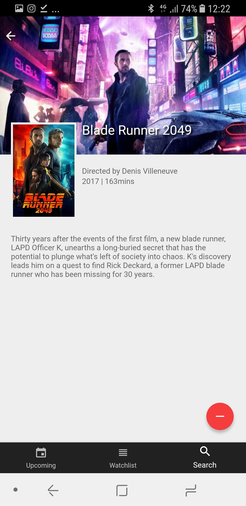
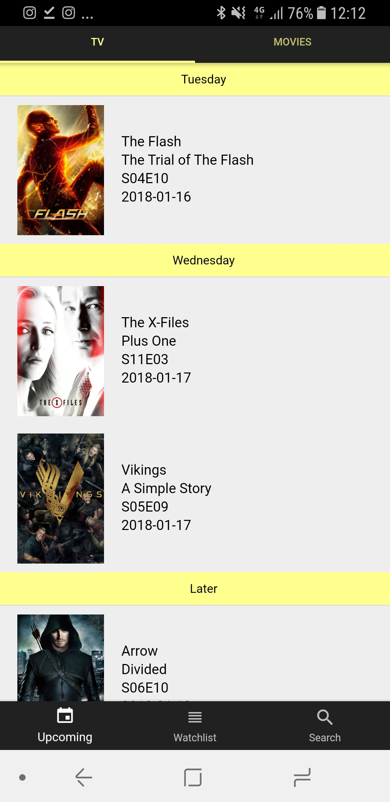

# Erinra
The exam project for the university course 'Mobile web applications'




👉 Please note that this has only been tested with NodeJS10, newer version might give errors! 👈

## To test run in a browser (Linux/MacOS):
Go to https://developers.themoviedb.org/3/getting-started/introduction to grab a API key that is required for the project to work.

```bash
# Begin with installing Ionic CLI
npm install -g @ionic/cli

# then install Apache Cordova
npm install -g cordova

# finally cd into the Erinra directory and run:
npm install

# insert your api key into the file src/providers/omdb-data/omdb-data.ts in 
# the variable apiKey in the begining of the file save and then run:
ionic serve
```
To build native builds for Android and iOS take a look at https://ionicframework.com/docs/v1/guide/publishing.html.


Project created by Marvan Al Kufai & Andreas Glimne
